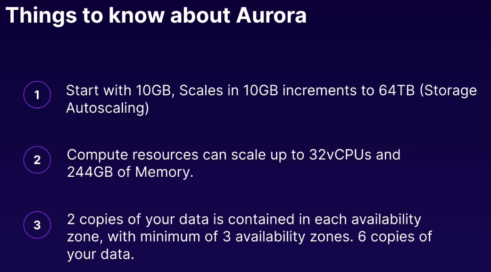
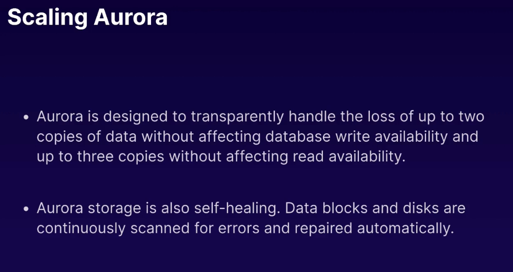
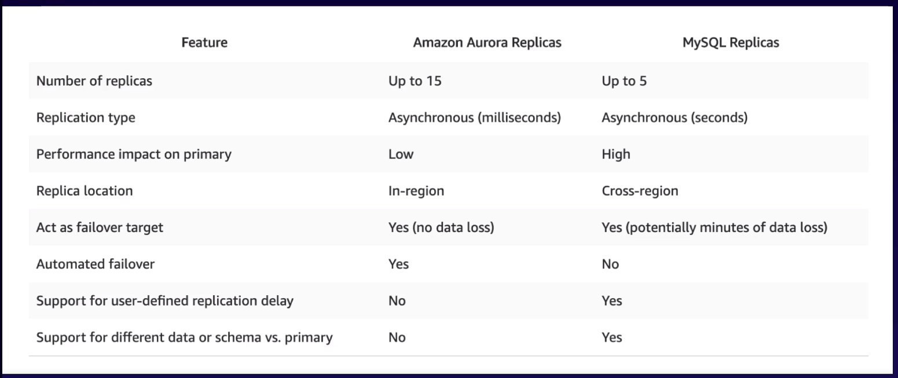
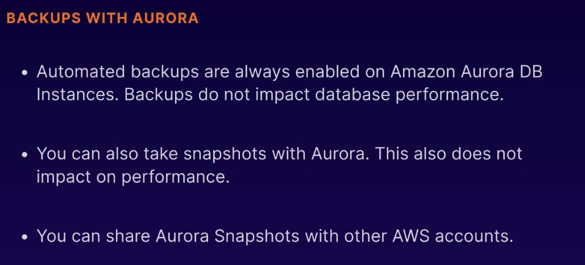
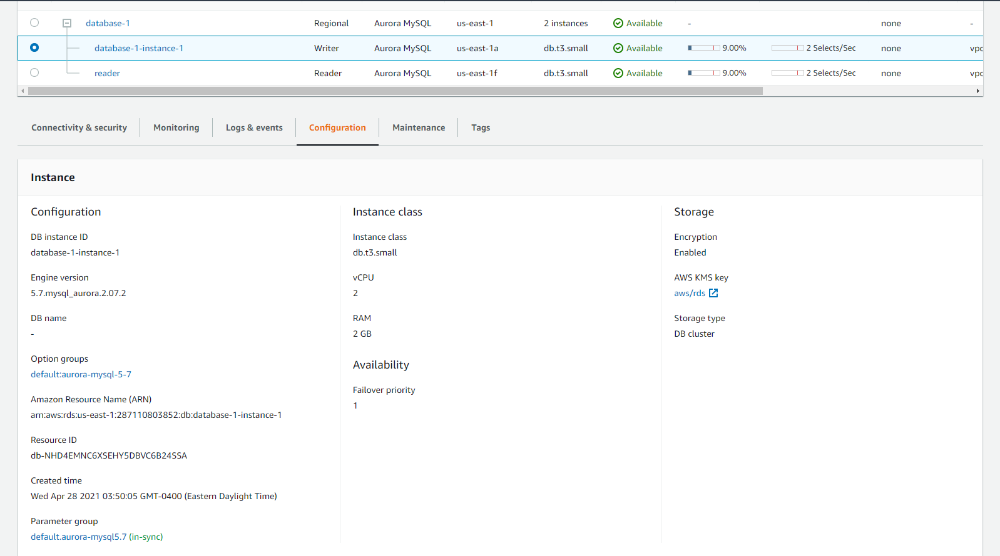
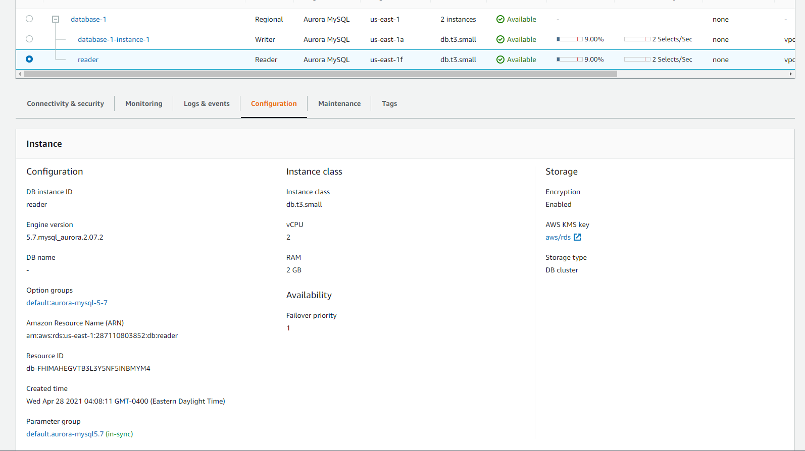

# Amazon Aurora

Amazon Aurora is a MySQL and PostgreSQL-compatible relational database built for the cloud, that combines the performance and availability of traditional enterprise databases with the simplicity and cost-effectiveness of open source databases.

## Benefits:

#### High Performance and Scalability:
    - Amazon Aurora is up to 5X faster than standard MySQL databases and 3X faster than standard PostgreSQL databases.
    - It provides the security, availability, and reliability of commercial databases at 1/10th the cost.
    - To scale read capacity and performance, you can add up to 15 low latency read replicas across three Availability Zones.
    - Amazon Aurora automatically grows storage as needed, up to 128TB per database instance. 
  
#### High Availability and Durability:
    - Amazon Aurora is designed to offer greater than 99.99% availability, replicating 6 copies of your data across 3 Availability Zones and backing up your data continuously to Amazon S3.
    - It transparently recovers from physical storage failures; instance failover typically takes less than 30 seconds.

#### Highly Secure:
    - Amazon Aurora provides multiple levels of security for your database. These include network isolation using Amazon VPC, encryption at rest using keys you create and control through AWS Key Management Service (KMS) and encryption of data in transit using SSL.

#### MySQL and PostgreSQL Compatible:
    - The Amazon Aurora database engine is fully compatible with existing MySQL and PostgreSQL open source databases, and adds compatibility for new releases regularly.

#### Fully Managed:
    - Amazon Aurora is fully managed by Amazon Relational Database Service (RDS). You no longer need to worry about database management tasks such as hardware provisioning, software patching, setup, configuration, or backups.

#### Migration Support:
    - MySQL and PostgreSQL compatibility make Amazon Aurora a compelling target for database migrations to the cloud.

## AWS Console

